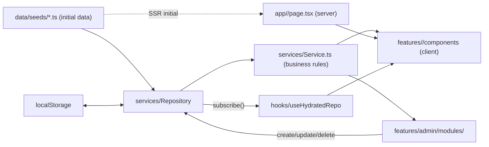

# Laxmi Dairy Farm — Bilingual PWA + Storefront + Admin CMS

A modern, mobile-first, bilingual (English / Hindi) Progressive Web App for **Laxmi Dairy Farm** — built with Next.js 15, Ant Design v5, SCSS Modules and Framer Motion. The site combines a storytelling public site (about / cows / care / training / gallery / contact), a small e-commerce storefront (milk / ghee / curd / paneer / butter / mawa / sweets) with a demo Cash-on-Delivery checkout, and a full admin CMS to manage every piece of content and engagement on the site.

> **Phase 1** (this branch): UI + admin CMS with `localStorage`-backed dummy data. No backend, no real auth, no real payments.
> **Phase 2** (next): swap the repository layer to Supabase + Razorpay. See [`docs/phase-2-roadmap.md`](./docs/phase-2-roadmap.md).

---

## Tech stack

| Layer | Tech |
| --- | --- |
| Framework | **Next.js 15** (App Router, TypeScript, React 18) |
| UI Library | **Ant Design v5** + `@ant-design/nextjs-registry` (SSR) |
| Styling | **SCSS Modules** with a custom design system |
| Animations | **Framer Motion** v11 |
| i18n | **next-intl** v3 (`en` + `hi` with locale-prefixed routes) |
| State | **Zustand** (cart, admin session) |
| Forms | **React Hook Form** + **Zod** validation |
| Data | Repository pattern → `localStorage` (Phase 1) → Supabase (Phase 2) |
| Icons | **lucide-react** + `@ant-design/icons` |
| PWA | **@ducanh2912/next-pwa** (manifest, SW, install prompt) |

---

## Quick start

```bash
npm install
npm run dev          # http://localhost:3000
npm run build        # production build
npm run type-check   # TypeScript check
```

PWA features are **disabled in dev** and active in production builds.

Admin login (Phase 1, demo): visit `/en/admin/login` and use the demo credentials shown on screen.

---

## Architecture (single source of truth)



The public storefront and the admin CMS read and write through the **same repository instances**. SSR uses the seed data so the first paint is identical for everyone; on the client, `useHydratedRepo()` subscribes to the repo and re-renders whenever an admin edit lands. Swap the repo's `localStorage` backing for a real API and the entire UI keeps working unchanged.

---

## Project structure

```
src/
├── app/                                  # Next.js routes (thin adapters)
│   ├── page.tsx                          # Root → redirects to default locale
│   └── [locale]/
│       ├── (public)/                     # Public site (Header / Footer / BottomNav)
│       │   ├── page.tsx                  # Home
│       │   ├── about/, cows/, cow-care/, gallery/, training/, contact/
│       │   └── products/                 # Storefront listing + detail + cart + checkout success
│       ├── (admin)/admin/                # Admin CMS (own shell, no public chrome)
│       │   ├── login, dashboard, products[/new|/[id]], categories[/new|/[slug]],
│       │   ├── orders[/[id]], cows, diseases, trainings, gallery, team, facilities,
│       │   ├── awards, testimonials, enquiries, enrollments, subscribers,
│       │   ├── site-content, settings
│       └── offline/                      # PWA offline fallback
├── features/                             # Domain modules (UI + local logic)
│   ├── home/, about/, cows/, care/, gallery/, training/, contact/
│   ├── products/                         # Storefront listing, detail, cart drawer, cart page,
│   │                                     # checkout success
│   └── admin/
│       ├── components/                   # AdminShell, Sidebar, Guard, DataTable, FormShell,
│       │                                 # BilingualInput, PageHeader, StatusTag, ConfirmDelete
│       └── modules/<resource>/           # One folder per CMS resource: View + Form
├── services/                             # Repository, entity services, settings, cart, order, auth
├── stores/                               # Zustand: useCartStore, useAdminAuth, useUIStore
├── hooks/                                # useBilingual, useDebouncedValue, useScrollDirection,
│                                         # useHydratedRepo, useHydratedSettings
├── ui/                                   # Design-system primitives (Container, PageBanner,
│                                         # PriceTag, Rating, EmptyState, Loader, BilingualText,
│                                         # SectionHeader, AnimatedSection, StatCounter)
├── layout/                               # Header, Footer, MobileBottomNav, LanguageToggle,
│                                         # WhatsAppFAB, PWAInstallPrompt
├── data/seeds/                           # Static seed data per entity (single source on first load)
├── types/                                # Domain types per entity
├── lib/                                  # constants, formatters, routes, validators (zod),
│                                         # animations, antd-theme
├── i18n/                                 # next-intl routing + messages/{en,hi}.json
└── styles/                               # SCSS globals/variables/mixins/animations
```

---

## Public pages

1. **Home** — Hero → Features → Our Story + stats → Products teaser → Breeds carousel → Knowledge preview → Training preview → Testimonials → Newsletter.
2. **About** — Hero → Founder's message → Timeline → Facilities → Team → Awards.
3. **Cows** — Filter chips (indigenous / exotic / crossbreed) + grid + compare modal (up to 3).
4. **Cow Detail** — Gallery + stats + tabs.
5. **Cow Care** — Search + category filter + article cards.
6. **Care Article** — Hero + symptoms / causes / prevention / treatment + disclaimer.
7. **Gallery** — Photos + Videos + custom lightbox.
8. **Training** — Stats banner + program cards.
9. **Training Detail** — Description / syllabus / instructor + sticky enrollment form (RHF + Zod, persists to `enrollmentService`).
10. **Contact** — Info cards + form (RHF + Zod, persists to `enquiryService`) + map + WhatsApp FAB.
11. **Products** — Category chips + product grid with search/sort/availability filter.
12. **Product Detail** — Gallery + variant picker + stock-aware add-to-cart.
13. **Cart** — Stock validation, min-order, pincode serviceability, COD-only checkout (UPI / Card marked Coming soon).
14. **Checkout Success** — Order summary backed by `orderService.getByNumber(...)`.

---

## Admin CMS

A complete CMS for every domain in the site, all backed by the repository pattern. Each resource ships:

- A list view (`<X>View.tsx`) with search, filters and a `+ New` button.
- A form (`<X>Form.tsx`) for create + edit, sharing `FormShell`, `BilingualInput`, `PageHeader` and `confirmDelete`.
- Route pages at `/admin/<resource>` (list), `/admin/<resource>/new` (create) and `/admin/<resource>/[id|slug]` (edit).

Resources covered: **Products** (variants / pricing / stock / badges / rating / nutrition), **Categories**, **Orders** (status updates), **Cows**, **Diseases / Care articles**, **Training programs**, **Gallery items** (photo or video), **Team members**, **Facilities**, **Awards**, **Testimonials**, **Enquiries**, **Enrollments**, **Subscribers**, **Site content** (homepage hero copy + headline stats), **Settings** (brand / contact / social / delivery rules + serviceable pincodes as a tag editor).

Validation is centralised in `src/lib/validators/*.ts` (Zod). The Product form runs a final `productFormSchema.safeParse(...)` before persisting so the schema stays the canonical contract even though Ant Design Form drives field-level validation.

---

## Storefront, cart and checkout

- Add-to-cart clamps quantities to `variant.stockQty` (in `useCartStore`).
- `cartService.summarise(...)` returns a typed `CartSummary` with `issues[]` covering `MIN_ORDER`, `PINCODE_NOT_SERVICEABLE`, `STOCK_EXCEEDED` and `PRODUCT_UNAVAILABLE`.
- Checkout uses the shared `checkoutSchema` and only enables Cash-on-Delivery in Phase 1; `orderService.placeOrder(...)` decrements stock atomically and rejects if any variant short-stocks.
- Order numbers are stable: `Math.max(0, ...existing) + 1` → `LD-YYYY-NNNN`.

---

## i18n (English + Hindi)

- Routes are locale-prefixed: `/en/...`, `/hi/...` (default `en`).
- Header carries an `EN / हि` language toggle.
- All UI strings live in [`src/i18n/messages/en.json`](src/i18n/messages/en.json) and [`hi.json`](src/i18n/messages/hi.json).
- Domain content (cows / diseases / training / products / etc.) carries bilingual fields shaped `{ en, hi }` so admin edits keep both languages in sync.

---

## PWA features

- `public/manifest.webmanifest` (generated from `src/app/manifest.ts`).
- Auto-generated service worker via `@ducanh2912/next-pwa` (disabled in dev).
- `PWAInstallPrompt` appears a few seconds after first visit on supported browsers.
- Offline fallback at `/<locale>/offline`.
- Theme color `#2E7D5B`; safe-area inset support for iOS notch / Android gesture bar.
- Mobile bottom nav (home / products / cows / training / contact) like a native app.

---

## Replacing dummy data

Initial content lives in [`src/data/seeds/`](src/data/seeds/) — one file per entity. On first load each repository copies its seed into `localStorage` and reads from there afterwards.

Two ways to replace it:

1. **Edit the seeds in code** — best when you know the final content up front. Bilingual fields use `{ en, hi }`.
2. **Use the admin CMS** — open `/<locale>/admin`, sign in with the demo credentials, and edit through the forms. Edits persist in `localStorage` and the public site re-renders live via `useHydratedRepo`.

Images currently use `https://picsum.photos/...` (random) and `https://i.pravatar.cc/...` (avatars). Replace with real `next/image`-friendly URLs (and add the domain to `next.config.ts → images.remotePatterns`) or local files in `public/`.

When you're ready for a real backend, swap `src/services/repository.ts` to call your API — the rest of the app keeps working.

---

## Phase 2 roadmap (planned)

See [`docs/phase-2-roadmap.md`](./docs/phase-2-roadmap.md). Highlights:

1. **Supabase** — schema + Auth + Storage buckets for media (image upload to replace URL-only fields).
2. **Admin CRUD over the network** — replace the `Repository<T>` localStorage backing with Supabase queries.
3. **Form submissions** — same `enquiryService` / `enrollmentService` / `subscriberService` interfaces, but persist remotely + email via Resend.
4. **Payments** — Razorpay for product checkout and training enrollment.
5. **Analytics & SEO** — GA4, sitemap, OG images per page, meta tags from settings.
6. **Mobile app** — wrap the PWA via PWA Builder for Android / iOS.
7. **E2E tests** — Playwright smoke flow over public site + admin CRUD.

---

## Scripts

| Script | Purpose |
| --- | --- |
| `npm run dev` | Start dev server with HMR |
| `npm run build` | Production build (also generates SW) |
| `npm run start` | Serve production build |
| `npm run lint` | Run Next.js lint |
| `npm run type-check` | TypeScript strict check (no emit) |

---

## License

MIT — for internal use by Laxmi Dairy Farm.
